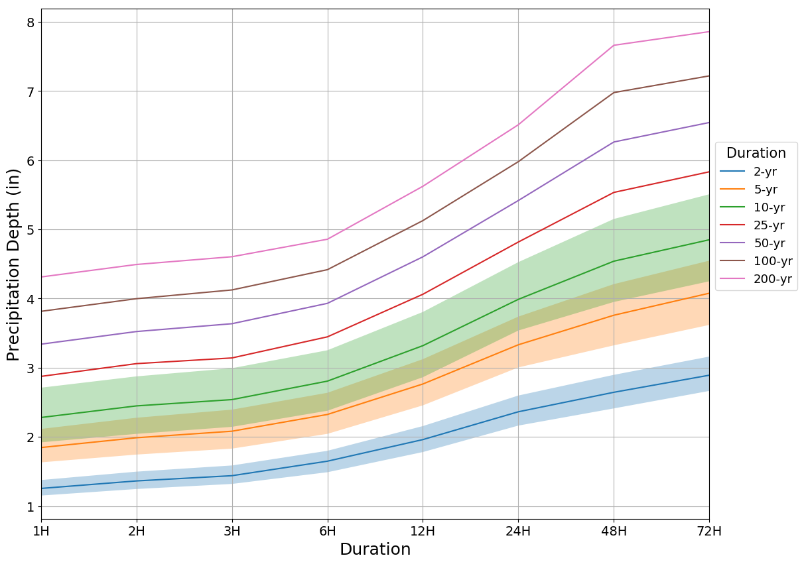

# Construct Historical IDF Curves
Collection of Python scripts to construct historical [IDF curves](https://en.wikipedia.org/wiki/Intensity-duration-frequency_curve) from hourly station data.

## Dependencies
```
pandas >= 0.20.3
scipy >= 0.19.1
matplotlib >= 2.1.0
```

You can run the scrip `run.py` to use all capabilities of the collection.

## Required input

- Hourly time series. Format should be `csv`, one column being the date of observation,
and the second column the rainfall accumulation. You are required to specify the path
where the hourly time series csv file is located.

## Output

- Multiple Duration Annual Maximum Series (AMS) computed using either sliding maxima or fixed maxima, which is specified by the user. Output file format is csv. The first column being the year and several other columns with the maximum over 1H, 2H, 3H, 6H, 12H, 24H, 48H and 72H durations.
- Rainfall depth for each duration above and average recurrence intervals 2-, 5-, 10-, 25-, 50-, 100- and 200-year with confidence intervals. By default confidence intervals are computed at the 90% confidence level using 1000 bootsrapped samples of the AMS.


## Example:

After cloning this repository, in your terminal run:

```sh
python run.py \
    --path=/Users/tanialopez/USC00360821.csv \
    --savepath=/Users/tanialopez/resultsIDF \
    --figformat=png
```

where `/Users/tanialopez/USC00360821.csv` is the path to the [COOP station id USC00360821](https://www.ncdc.noaa.gov/homr/#ncdcstnid=20016672&tab=MSHR) hourly time series (previously obtained and cleaned from the National Oceanic and Atmospheric Administration National Centers for Environmental Information[here](https://www.ncei.noaa.gov/data/coop-hourly-precipitation/v2/)), `/Users/tanialopez/resultsIDF` is the location of a directory where to store all output, and `png` is the desired format of the figure with the IDF curves.

Other options are:

- saveAMS, bool. Option to save AMS. *Default value: True*
- ftype, str. Approach to construct AMS, either 'sliding' or 'fixed'.
- ci, bool. Option to compute confidence intervals.
- number_bootstarp, int. Number of bootstrap samples to generate. *Default value: True:
- alpha, float. Confidence level, e.g. 0.9 *Default value: 0.9*


Example output:



### Acknowledgements

We are grateful to the the National Oceanic and Atmospheric Administration for making the station hourly observations available that were used during testing.
